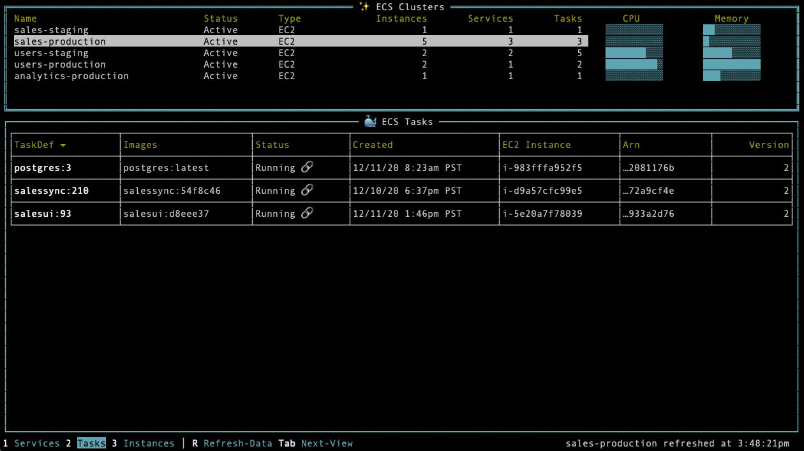

    

Browse your AWS ECS Clusters in the Terminal.

---

> [!NOTE]
> As of October 2023 this project is no longer maintained. I recommend using [e1s](https://github.com/keidarcy/e1s) to view and manage your ECS resources from the terminal

The `ecsview` application is a terminal-based UI for browsing Amazon Elastic Container Service (ECS) clusters. You can use it to view cluster usage, services, tasks, and individual container instances (ec2's). Uses the excellent [tview](https://github.com/rivo/tview/) library to build and manage the UI.

## Installation

Run `make install` to install ecsview in your Go binaries directory.

## Usage

Run `AWS_PROFILE=<profile> ecsview` with a configured AWS profile to view your account's ECS clusters in detail.

